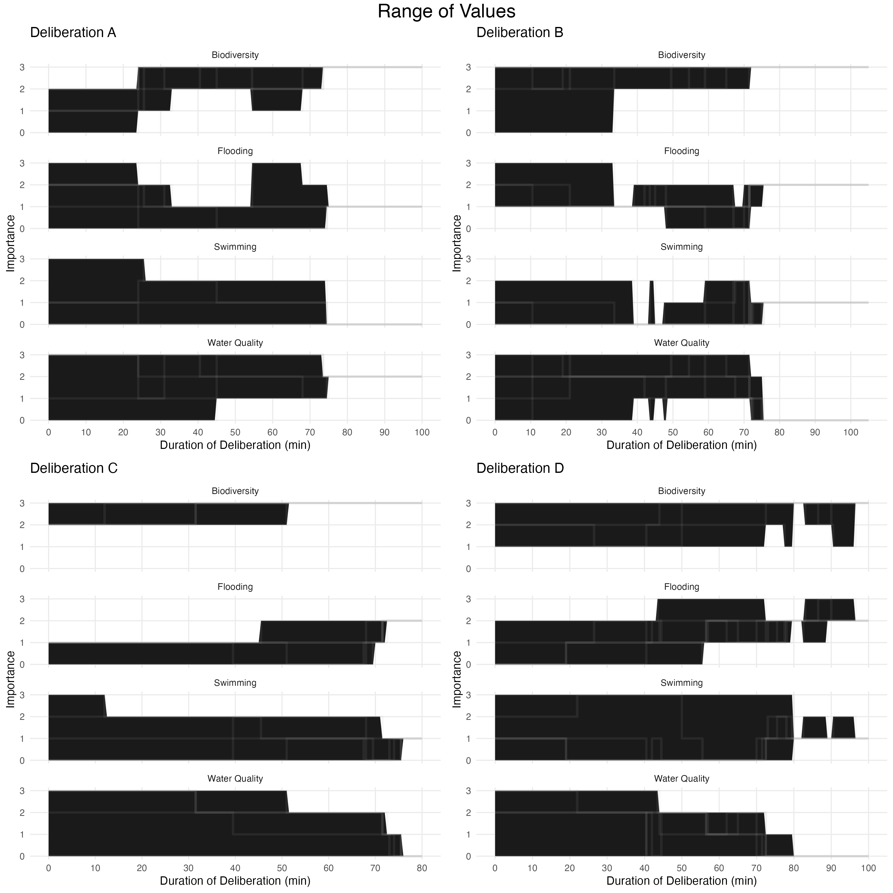
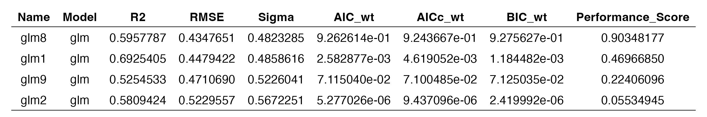
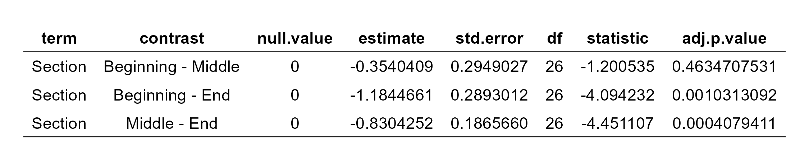

LaRosee, Christopher

Transforming Individual to Collective Values: Understanding Convergence Dynamics in Deliberative Multicriteria Evaluation Experiments

Christopher LaRosee

23 December 2023

University of Massachusetts, Boston

Biology Department

Final report for BIO 607/617

Professor: Dr. Jarret Byrnes

TA: Cooper Kimbal-Rhines

# Abstract

Purpose--- This study investigates the dynamics of New Hampshire residents' values of ecosystem services through the time of deliberative multicriteria evaluation experiments.

Design/methodology/approach--- This study uses deliberative multicriteria evaluation (DMCE) to understand how New Hampshire (NH) residents' individual values transform into collective values of four benefits a local river provides. DMCE uses hypothetical scenarios where different ecological benefits (ecosystem services) are ranked on a weighted scale by their importance to a deliberation of people in a deliberative context.

Originality/value--- This study introduces a novel way to measure the transformation of individual ecosystem service (ecosystem service) values toward shared social values. This method includes statistical hypothesis testing using non-parametric regression modeling for the calculated parameter, "convergence."

Findings--- Findings show that participants' ecosystem service values significantly differed depending on the section of the deliberation (beginning, middle, end). The mean difference for convergence (as scaled from 0 -- 3) between the beginning and the end was -1.18 (p = 1.0e-3), and the mean difference between the middle and end was -0.830 (p = 4.0e-4). The mean difference between the beginning and the middle was -0.354 (p = 0.46), but this relationship was not significant.

Research limitations/implications--- Analysis was limited due to a small sample size, and the high computational demand of analysis prevented analysis of convergence as a function of residuals about the mean value. Directions for future research include testing this new measurement on a larger dataset or as a meta-analysis.

Keywords: Ecological Economics, Deliberative multicriteria evaluation, Ecosystem services, Shared social values

# Introduction

## Quantifying Benefits from Ecosystems

We can measure an ecosystem's expected profit under different use conditions. For example, what is the expected profit for using a forest for logging versus eco-tourism? Valuing an ecosystem in such a way is great for determining the most profitable ways to use an ecosystem. It provides a way for ecosystems to be exchanged for monetary compensation. It takes ecosystems and assigns a dollar value fitting into our economic framework. This method's problem is mainly that the quantified benefit is solely the benefit to decision-makers.

Suppose we want to generalize values to the benefits received by a community instead of just to the decision-makers/landowners. In that case, we must have a way of sampling the values of various community members, not just those with the ultimate decision-making power. Researchers have tried asking community members how much they value an ecosystem (CITE A SURVEY STUDY OR STRUCTURED INTERVIEWS). These values can then be aggregated providing a way of considering the values of an ecosystem to a larger population than just decision-makers/landowners. However, problems arise when researchers take the liberty of equating any aggregate of individual community member preferences to the community's preferences as a whole. The values of a community as a whole often differ from the values of the constituent members of the community.

## Deliberative Valuation

Deliberation is a decision-making method that engages community members in values-based discourse around a particular topic. If we sampled a population and asked about their values for the benefits they receive from an ecosystem, we could have different results than if we asked them to value them as a deliberation consensus (Mavrommati et al., 2021)(Murphy et al., 2017). Any member of society plays different roles at any given time (Raworth, 2017). When we elicit values from individuals in the context of surveys or interviews, we only shed light on the benefits to a self-interested, calculating, and omniscient member who is reflecting upon their personal needs and desires. On the other hand, deliberation elicits a different kind of value: shared social values. While individual values focus on personal reflection, shared social values are formed through communication, justifying reasoned arguments, consultation with experts from multiple disciplines, and consideration for the common good(Lyon-Mackie et al., 2023).

## Deliberative Multi-criteria Evaluation (DMCE) Methodology

Researchers have implemented a deliberate valuation for ecosystem services (Proctor & Drechsler, 2006). These methods elicit shared social values. Shared social values form through the process of social learning which allows people to think outside of their own needs and explicitly consider the needs and preferences of other community members. This process drives the transformation of individual values into shared social values (Figure 1) (Mavrommati et al., 2021). The specific method we used to elicit these kind of values is deliberative multicriteria evaluation (DMCE). First implemented in a project that helped Australian land managers decide on options for recreation and tourism (Proctor & Drechsler, 2006), this method combines the strengths of multicriteria evaluation with deliberation by providing a structure to the multiple dimensions of benefits an ecosystem has to offer by having participants deliberate on the weighted values for multiple criteria of an ecosystem. Example of such criteria, include biodiversity, water quality, aesthetics, and public access (Proctor & Drechsler, 2006).

Further research has advanced this methodology by tasking participants with serving on citizens' juries responsible for assigning weighted ranks to different hypothetical scenarios (Mavrommati et al., 2017). Each scenario is a printed graphic representation which is printed and laminated to provide participants with the information they need to arrange the physical print outs along the length of a meter stick to represent a 0 -- 100 scale from most desirable (0) to least desirable (100). This information includes a symbolic representation of several benefits received from the ecosystem of interest. Each benefit is quantified on a measurable scale so that the scenarios can have all of these benefits placed at their optimal level except for one that is swung to its reverse level. In DMCE deliberations, participants arrange the scenarios on a 0-100 scale from most desirable (0) to least desirable (100). This method was used because it allows for analyzing both quantitative and qualitative data (Mavrommati et al., 2021).

Suppose we compare a DMCE deliberation to a jury tasked to decide the guilt of an alleged murderer. Participants start by hearing the testimony of witnesses. After all evidence is reviewed, the jurors sit together to begin deliberating. If we did a poll to see who thought the defendant was guilty, we would elicit individual opinions of the jurors from their reflections on the evidence they had reviewed. There is a reason we do not decide on cases in this way. Instead, the jurors communicate with each other, sharing and justifying their interpretations with reasoned arguments, listening to opposing perspectives, and ultimately coming to a mutual understanding of the problem. The resulting consensus (or lack of) decides whether the culprit is convicted, freed, or responsible for pleading their case to a new jury (if hung).

With DMCE, participants from a community come together to hear experts from diverse disciplines present on a particular problem. These presentations draw parallels to testimony provided by witnesses in the above example jury. Participants then split into deliberations of 5-8 to form "citizens juries" tasked to deliberate on weighing the relative importance of different benefits received from an ecosystem on a 0 -- 100 scale. Using this method, two ecosystem services cannot share the same value, so we can derive a specific order in how the ecosystem services are ranked. The deliberation is encouraged to reach a consensus---representing their verdict---but doing so is not required.

Studies have examined the effect of DMCE experiments on participants' values by conducting a survey before and after deliberation and trying to understand if the values changed. One way to understand this change is to measure the degree of convergence or divergence of values as a way of understanding if values tend toward alignment with each other as a result of deliberation. This measurement typically involves pre- and post-deliberation surveys with participants assigning weighted ranks to the ecosystem services (Mavrommati et al., 2021) (Tobin et al., 2023) (Lyon-Mackie et al., 2023)(Murphy et al., 2017).

Figure 1: The process of individual values transforming into shared social values (Mavrommati et al., 2021)

Of all the research using DMCE, one example examines how preferences change throughout the deliberation process (Mavrommati et al., 2021). In this study, which I co-authored as an undergraduate student, four deliberative experiments were conducted, and the values for every participant were plotted through the time of each deliberation instead of just before and after. The analysis contained herein used the data from this study as an example to test this methodology. Since each ecosystem service is valued by a rank ordered by importance, the sum of values for each participant is always 10 (1 + 2 + 3 + 4). Therefore, if swimming days fall from 4 (most important) to 3, the ecosystem service that was previously a 3 gets elevated to a 4. In other words, values can change either due to a direct change in value for that ecosystem service and Participant or due to the implicit shift in values due to a change in value for a different ecosystem service. The resulting plots are recreated in Figure 2. Each participant's journey is traced through as the of deliberation commences, showing values as ranks on the y-axis. These plots roughly show when each ecosystem service is most heavily discussed. The values were derived by examining transcripts for words such as "I do not think water quality is as important to me anymore," which triggers a value change. However, it is not easy to make firm conclusions about exactly how preferences are converging due to the high amount of information that is provided.

Figure 2: Preference Analysis Plot for Deliberation C (Mavrommati et al., 2021)

## Research Questions and Hypothesis

The point of this essay and the way the present research contributes to the use of DMCE in ecosystem services valuation is by linking the previously conducted analysis' of convergence as a pre-and post-deliberation prospect toward a metric that can be assessed at any point in the time of deliberation, as we did with individuals preferences. The questions this project focused on were: 1) How do values converge within the time of a deliberation?; 2) How does the convergence of values vary throughout the time of the deliberations? To answer question two, we ask four component questions: 2a) Is there a difference between the amount of convergence in the beginning versus the end?; 2b) Is there a difference between the amount of convergence in the middle versus the end?; 2c) Is there a difference between the convergence in the beginning and the middle sections?; 2d) What is the strength and direction of these relationships?

I hypothesize that there is a difference between the amount of convergence occurring in the beginning versus the middle, the middle versus the end, and the beginning versus the end, with the most substantial relationship occurring between the start and the end. We divided the deliberation time---from the first point of convergence until the last moment of convergence--into three equal sections to represent the beginning, middle, and end. This transformation offers an intuitive representation of how much convergence occurs in each section of the analyzed deliberations. The reason for expecting the most substantial difference between the beginning and the end is because the value dynamics plots (Figure 2) show that all deliberations eventually reach a consensus. Further, there appear to be more dynamics in individual values closer to reaching consensus than at the beginning of the deliberation. I also expect the beginning and middle, and the middle to end, to show a similar pattern but to a lesser degree. We know that participants start with diverse values and reach a consensus; therefore, more convergence occurs than divergence. Without this condition, the deliberations would have never reached a consensus. The following section details the steps taken starting with raw data collection and leading to statistical modeling using r (R Core Team, 2023).

# Methods

Raw data were collected as video recordings during the process of each deliberation. A transcription service (Rev.com, 2023) transcribed these video recordings into timestamped documents. Transcripts were coded by three independent researchers for dialogue that offered evidence for value changes. The evidence was tabulated with separate columns: the participant ID, the time of the deliberation, the value for each ecosystem service, the quote, and a short justification for why the quote should be considered a preference change. For each instance of a value change, these columns were populated and cross-referenced. After all occurrences were recorded, the rankings of participants were added to point 0:00:00 as the values the participants indicated in their pre-deliberation survey, and the value for the final value change was duplicated for the end of the deliberation to infer that preferences values were unchanged from their last change.

## Measuring Convergence

To understand how values converge, we must have a metric to measure them. The analysis first considered using an aggregate of the distance of each participant's value from the mean value for all participants at a given time. However, this option was limited by the computational power required for these calculations. Instead, the range of values from the minimum and maximum value across participants for each deliberation and ecosystem service was calculated and rescaled so that the higher values represent convergence rather than divergence.

## Data Preparation

For the statistical analysis, the data was processed by extracting the time as a decimal minute using the package zoo (Zeileis & Grothendieck, 2005). This minute was rounded to the nearest whole number to make the values compatible with a function that interpolates the values of all columns every 0.5 minutes by referencing the most recent non-na value for that deliberation and participant. Following this, the range between the maximum and minimum rank for all participants was added for each deliberation and ecosystem service. This range/convergence was then smoothed using the tidyverse package (Wickham et al., 2019) for a more straightforward visual interpretation to understand trends rather than moment-to-moment fluctuations. The smoothing function took the rolling mean of the values within the past ten minutes. The convergence rate was then calculated as the difference in the convergence from the present point to the point of time minus 10 minutes. After this, convergence was separated from divergence by moving all negative values to the divergence column, and active discussion time was extracted by excluding periods before and after the first and last convergence. Finally, for each discrete time section (beginning, middle, end), ecosystem service, and deliberation, the sum of all convergence values was multiplied by the maximum time for that section to extract the value directly proportional to the amount of convergence and the amount of time spent converging. These sums are the values that were used for statistical models predicting for convergence. In each deliberation, there are four samples across three sections for all ecosystem services for a total of N = 16 for each section.

# Results

## Plotting Convergence

The plot in Figure 3 is similar to the exploitative graph I discussed (Figure 2). However, instead of showing the values for every participant, the spread of values is generalized by shading the area between the minimum and maximum values for all participants. This plot makes it easier to see how much disagreement there is in the deliberation. It does not show the mean value, but this is not needed. After all, convergence is just how spread out the values are. Even if just one participant's values diverge from the rest of the deliberation, the result is that all participants' values are evenly spread across the same range.

Figure 4 shows this convergence value over time as it relates to the range values from Figure 3. You can see that all values eventually reach three, which, in this case, corresponds to the highest level of convergence. You can also see that swimming and water quality start at the lowest level of convergence because they are the most spread out possible.

Figure 5 shows the rate of change of convergence. This plot shows the amount of convergence as the area shaded above the zero line and divergence as the area shaded below the 0 line. The shaded area representing the amount of convergence is the value the following models predict.

Figure 3: Range of values for all four deliberations

Figure 4: Convergence for all four deliberations

Figure 5: Convergence rates for all four deliberations. Convergence is the area filled orange and divergence is the area filled blue.

## Initial Observations

After calculating the amount of convergence occurring in each section of the deliberations, the resulting values were plotted using a box-and-whisker diagram against the three variables used to deliberation for the convergence calculation. The first plot (Figure 6: Section of Deliberation) shows evidence of a relationship with convergence increasing as the deliberation goes from the beginning through the middle to the end. The middle plot (Figure 6: Deliberation) shows that convergence varied substantially across the four deliberations, with Deliberation A having the widest range and Deliberation B having the lowest. In the third plot (Figure 6: Ecosystem Service), the spread of values is more even than with the other two categories, and the mean is about 1 for all ecosystem services except for "Flood Mitigation," which has a mean of about 1.5 and the widest spread of values for all ecosystem services.

Figure 6: Distribution of Convergence before filtering non-zero occurrences across the categorical variables: Deliberation Section, Deliberation, and Ecosystem Service

## Fitting Models and Testing Assumptions

I started with three linear models with the predictors: Section (model 1), Section and Deliberation (model 2), and Section and Ecosystem Service (model 3). Model 1 and model 2 violated the assumptions of homogeneity of variance and normality of residuals, and model 3 also violated these assumptions, plus the assumption of linearity. To work around these violations, the data were transformed by adding a binary operator column to generate logistic regression general linear models (GLMs) with the probability of a convergent time point for an ecosystem service represented as a binary outcome. For these models, the same predictors in models 1-3 were used in a GLM to make models 4-6. All three models violated the assumption of homogeneous variance and were omitted from further examination.

Finally, I fit three more models with the same variables, but this time excluded all entries with zero convergence as a GLM. The distributions of these convergences across deliberations, deliberation sections, and ecosystem services followed the same patterns highlighted in the prior section (Figure 3), providing evidence that this transformation does not obscure the interpretation of results. Of the three models that used these data, the model with the section as its sole predictor failed to meet the normality of residuals assumption. However, the remaining two models met all assumptions. Three more GLMs were made without filtering out zero values to serve as a reference point. Of these three, only the model that used the section violated any assumptions.

The models that passed all assumptions were compared by the Akaike Information Criterion corrected for finite sample sizes (AICc) weights to compare the models' predictive performance as a function of the models' complexity and goodness-of-fit (Table 1). The package performance provided functions for this process (Lüdecke et al., 2021). The model with the highest predictive power was the GLM, using section and deliberation as predictors. This model was used to calculate the mean effect of each section on the amount of convergence experienced in that section.

Table 1: Akaike information criterion corrected for small sample sizes (AICc)

## Model Results

The GLM that was selected has a null deviance of 14.96 and a residual deviance of 6.049. This reduction indicates that the model explains a substantial portion of the variability observed in the convergence. The effect of being in the middle section of the deliberation does not significantly affect the convergence (p = 2.4e-1), but the effect of being in the end section is associated with a mean convergence increase of 1.18 (p = 3.7e-4). Deliberation B (p=6.2e-1) and deliberation D (p=7.8e-1) did not significantly affect convergence. However, deliberation C has a significant effect of -0.6 (p=1.6e-2), representing the only negative and significant estimate in the model. See Table X for the complete list of estimates with their standard error, z-statistic, and p-value.

Table 2: output from broom package tidy() (Robinson et al., 2023)

Figure 7 shows the coefficients (x-axis) plotted as points for each predictor (y-axis) with error bars representing a 95% confidence interval. The predictors with error bars crossing the zero line are not statistically significant, and the magnitude and direction of the effect are shown as the distance between the point and the zero line.

Figure 7: Model coefficients for glm(formula = Convergence \~ Section + Deliberation)

## Estimated Marginal Means

A pairwise comparison of each section was performed with emmeans (Lenth, 2023) to show the estimated effects differences for each combination. The estimated difference between the effect of the beginning versus the middle is -0.35, indicating that, on average, convergence in the middle section is higher than at the beginning. However, this relationship is not significant (p=4.6e-1). The estimated difference between the beginning and the end is significant (p=1.0e-3) at -1.18, indicating that, on average, convergence at the end is, on average, 1.18 higher than at the beginning. Finally, the estimated difference between the middle and the end is -0.83, indicating that, on average, convergence is 0.83 higher than in the middle section, which is also statistically significant (p=4.1e-4). Table 3 includes these values with the standard errors, degrees of freedom, and z-statistics.

Table 3: GLM model estimates of marginal mean contrasts

## Discussion

The goal of this study is to understand how values converge throughout a deliberation by testing the following hypothesis: 1) There is a significant difference in convergence between the beginning and the end sections; 2) There is a significant difference in convergence between the middle and the end sections; 3) There is a significant difference in convergence between the beginning and the middle sections; and 4) The most prominent difference in convergence is between the beginning and end sections of the deliberation with the end exhibiting more convergence.

Figure 8: GLM model estimates of marginal mean contrasts plot

## Measuring Convergence

To find a metric to assess convergence, I developed a series of visualizations that progressively build upon each other until the final metric used for convergence is reached. The preference analysis plots (Figure 1) that I helped develop (Mavrommati et al., 2021) loosely show us the spread of values and qualitatively show that as the deliberation duration continues, more value changes occur with all deliberations reaching a consensus. These plots are what led to the initial hypothesis I proposed.

Figure 3 shows the same plots but with areas shaded to show the range in values, and participant lines are faded and colored grey. These plots show the range of values through time as the height of the shaded area at any point. Areas of high convergence occur as the boxes shrink through time. This plot shows convergence more clearly than Figure 1 but does not easily distinguish between convergence and divergence. Instead, it can be qualitatively inferred through observing the changes in the size of the areas.

Figure 4 shows the value for the range at any point in time as a line plot. The line can be correlated to the changes in the size of the boxes, with the highest level of convergence represented at a value of 3 and the highest level of divergence represented as a 0. The humps in the shape of the line represent instances of convergence when the line is sloped up and divergence when the line is sloped down.

Figure 5 shows the rate of convergence as the final and most precise plot representing convergence for this study. The area shaded above the 0 line is the total convergence, and the area below the 0 line is the total divergence. This plot makes it clear that there are many more occurrences of convergence than divergence, with all deliberations and ecosystem services experienced convergence close to the consensus. Biodiversity was the only ecosystem service to not experience divergence. All other ecosystem services either showed convergence only, or a mix or some divergence and mostly convergence within each deliberartion. Deliberation C had the least amount of divergence, with only one occurrence (for Flooding). Most occurrences of divergence occurred around the middle section of deliberations. There is a lot that can be inferred from these plots.

## Initial Observations

The initial box and whisker plot (Figure 6) shows a clear upward trend in the overall level of convergence from the start, to the middle, and to the end. No clear pattern is discernable in the convergence across deliberations, but the spread and mean values of convergence were somewhat stable across ecosystem services. This likely indicates that deliberation is a more critical factor than ecosystem service since convergence is stable within deliberations but inconsistent between them.

### Hypothesis 1: Convergence between Beginning and End

The GLM indicates a significant difference between the convergence at the beginning and the end of the deliberations (p = 3.7e-4). The analysis of estimated marginal means supported this by demonstrating that the mean effect of the deliberation section on the beginning versus the end is also significant (p = 1.0e-3); therefore, we can reject the null hypothesis that there is no difference in convergence from the beginning to the end.

### Hypothesis 2: Convergence from Middle to End

The analysis of estimated marginal means demonstrated that the mean effect of the middle section compared to the end is significant (p = 4.1e-4); therefore, we can reject the null hypothesis that there is no difference in convergence from the middle to the end.

### Hypothesis 3: Convergence from Beginning to Middle

The initial GLM does not indicate a significant impact on convergence between the beginning and middle sections of the deliberations (p = 2.4e-1). The analysis of estimated marginal means supported this lack of significance by demonstrating that the mean effect of the deliberation section on the beginning versus the middle is also non-significant (p = 4.6e-1). For this reason, the null hypothesis, that there is no difference between the convergence from the beginning to the middle, is not rejected.

### Hypothesis 4: Relationship is Strongest for End

The initial GLM indicates that the most influential predictor for convergence is whether a deliberation is at the end of the deliberation (p = 3.7e-4). The analysis of estimated marginal means also supported this hypothesis since the contrast comparing the end with the beginning had the largest coefficient of -1.18 (p = 1.0e-3) and the next largest estimate of -0.83 between the middle and end (p = 4.1e-4).

# Conclusion

This study's findings provide evidence supporting the dynamics of value convergence during the deliberations. The statistical analysis supports hypotheses 1 and 2 by finding significant differences in convergence between the beginning and end and between the middle and end sections. This finding implies that values tend to converge through the progression of the deliberations, especially in the later stages. Hypothesis 4 is also supported, indicating that the difference between the beginning and the end convergence levels will be the greatest between the three sections. On the other hand, hypothesis 3 is not supported, indicating no significant difference between the beginning and the middle sections.

Overall, these conclusions offer validation of the theoretical expectation of participants moving from diverse views toward a consensus through the social learning process and suggest that the relationship between time and convergence is not linear. Instead, they indicate that convergence tends to be more concentrated toward the end of the deliberations.

Future investigations could explore this relationship more granularly by studying the patterns in convergence with time as a continuous parameter or by using individual-level metrics such as a participant's residual difference from the mean. Also, looking for causality for the relationships highlighted through further qualitative analysis methods could provide a greater comprehension of the ways values are formed and transformed as a result of the social learning that occurs in deliberative valuation experiments. The role of value convergence could be fostered more generally as a critical element of any deliberative decision-making process.

# Works Cited

Lenth, R. V. (2023). emmeans: Estimated Marginal Means, aka Least-Squares Means. <https://CRAN.R-project.org/package=emmeans>

Lüdecke, D., Ben-Shachar, M. S., Patil, I., Waggoner, P., & Makowski, D. (2021). performance: An R Package for Assessment, Comparison and Testing of Statistical Models. Journal of Open Source Software, 6(60), 3139. <https://doi.org/10.21105/joss.03139>

Lyon-Mackie, J., Vella, P., DiBona, P. A., Shehab-Sehovic, N., Roche, S. B., Kreiley, A. I., & Mavrommati, G. (2023). Exploring stakeholders' ecosystem services perceptions across Massachusetts Bays using deliberative valuation. Frontiers in Environmental Science, 11, 1214879. <https://doi.org/10.3389/fenvs.2023.1214879>

Mavrommati, G., Borsuk, M. E., & Howarth, R. B. (2017). A novel deliberative multicriteria evaluation approach to ecosystem service valuation. Ecology and Society, 22(2), art39. <https://doi.org/10.5751/ES-09105-220239>

Mavrommati, G., Borsuk, M. E., Kreiley, A. I., Larosee, C., Rogers, S., Burford, K., & Howarth, R. B. (2021). A methodological framework for understanding shared social values in deliberative valuation. Ecological Economics, 190, 107185. <https://doi.org/10.1016/j.ecolecon.2021.107185>

Murphy, M. B., Mavrommati, G., Mallampalli, V. R., Howarth, R. B., & Borsuk, M. E. (2017). Comparing group deliberation to other forms of preference aggregation in valuing ecosystem services. Ecology and Society, 22(4), art17. <https://doi.org/10.5751/ES-09519-220417>

Proctor, W., & Drechsler, M. (2006). Deliberative Multicriteria Evaluation. Environment and Planning C: Government and Policy, 24(2), 169--190. <https://doi.org/10.1068/c22s>

R Core Team. (2023). R: A Language and Environment for Statistical Computing [Computer software]. R Foundation for Statistical Computing. <https://www.R-project.org/>

Raworth, K. (2017). Doughnut economics: Seven ways to think like a 21st century economist. Chelsea Green Publishing.

Rev.com. (2023). Rev \| AI Speech to Text Transcription Service. Rev. <https://www.rev.com/>

Robinson, D., Hayes, A., & Couch, S. (2023). broom: Convert Statistical Objects into Tidy Tibbles. <https://CRAN.R-project.org/package=broom>

Tobin, C., Urban-Rich, J., Larosee, C., & Mavrommati, G. (2023). The importance of discourse when discussing microplastic pollution with oyster stakeholders in Massachusetts, USA. Ambio, 52(9), 1488--1504. <https://doi.org/10.1007/s13280-023-01870-z>

Wickham, H., Averick, M., Bryan, J., Chang, W., McGowan, L. D., François, R., Grolemund, G., Hayes, A., Henry, L., Hester, J., Kuhn, M., Pedersen, T. L., Miller, E., Bache, S. M., Müller, K., Ooms, J., Robinson, D., Seidel, D. P., Spinu, V., ... Yutani, H. (2019). Welcome to the tidyverse. Journal of Open Source Software, 4(43), 1686. <https://doi.org/10.21105/joss.01686>

Zeileis, A., & Grothendieck, G. (2005). zoo: S3 Infrastructure for Regular and Irregular Time Series. Journal of Statistical Software, 14(6), 1--27. <https://doi.org/10.18637/jss.v014.i06>
